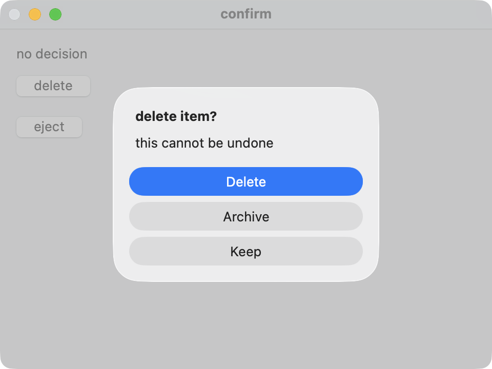
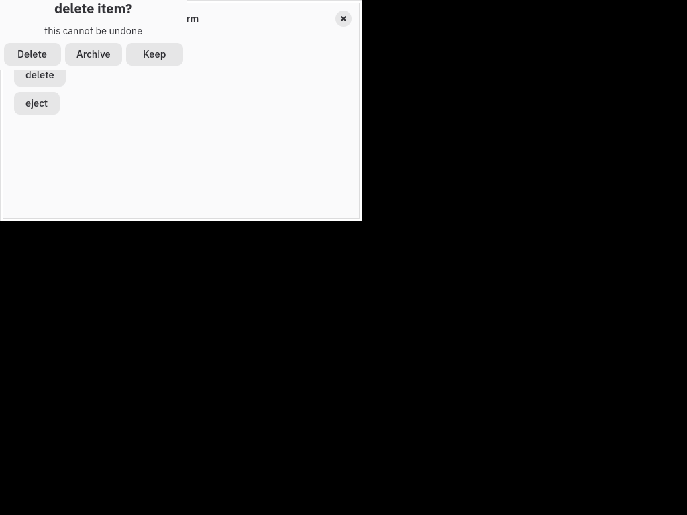
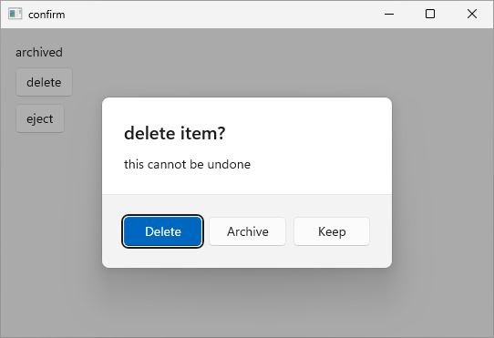

# C# async dialogs, 2026-09-20

C# can await alerts, single and multiple file pickers, save panels and clipboard
reads. The answer resumes on kaya's app thread without an open transaction.
Each explicit `Build` commits on return or rolls back if its body throws.
A later failure does not undo scopes that already committed.

The confirm guest now spells its interaction like this:

```csharp
tx.Button("delete", onClick: async _ =>
{
    var choice = await app.ShowAlertAsync(
        title: "delete item?", message: "this cannot be undone",
        action0: "Delete", action1: "Archive", cancel: "Keep");
    app.Build(tx => tx.Write(status, choice switch
    {
        AlertChoice.Action0 => "deleted",
        AlertChoice.Action1 => "archived",
        _ => "kept",
    }));
});
```

The native dialogs and answers are unchanged. The four existing scene scripts
exercise alerts, picking, saving and clipboard reads without any script edits.
Callback forms remain available. A second live alert or file dialog is refused
at the request; cancel resolves to the callback form's existing value.

## Native captures

These are actual runs of the C# confirm guest. Each image was inspected before
being included. C# currently ships on the three desktop lanes; iOS and Android
do not package this binding, so there is no C# phone capture for this slice.

### macOS



### Linux



### Windows



The Windows capture shows the third delete prompt, after the previous answer
set the label to `archived`. It is an original recorder frame, not a rendering.

## Guards and validation

The production app-thread check, stale-transaction check and synchronous-Build
refusal enforce the boundaries. check-abort runs the real binding and mutates
its queue, completion, rollback, reporter and request cleanup: eleven mutations,
each applied once and watched failing. The surface gate
holds the five Task signatures and the context's install, drain and wake wiring.
The latest core run passed 628 unit tests and 18 doctests (one ignored), and
all 61 gates passed. The standalone Mac lane passed 477 legs in 387 seconds.
The final matrix passed Mac 477, Linux 775, Windows 282, iOS 139, Android 148
and all 61 gates in 1258 seconds, with every unchanged runtime ceiling held.
An earlier Android startup ANR exposed missing recorder evidence; the recorder
was extended and proven with eight mutations and a forced red. The final run
followed a host reboot and does not establish an ANR fix. See the
[failure and recorder evidence](../../measurements/android-anr-2026-09-20.md).

Swift, Java and Rust follow in separate slices under the same approved contract.
