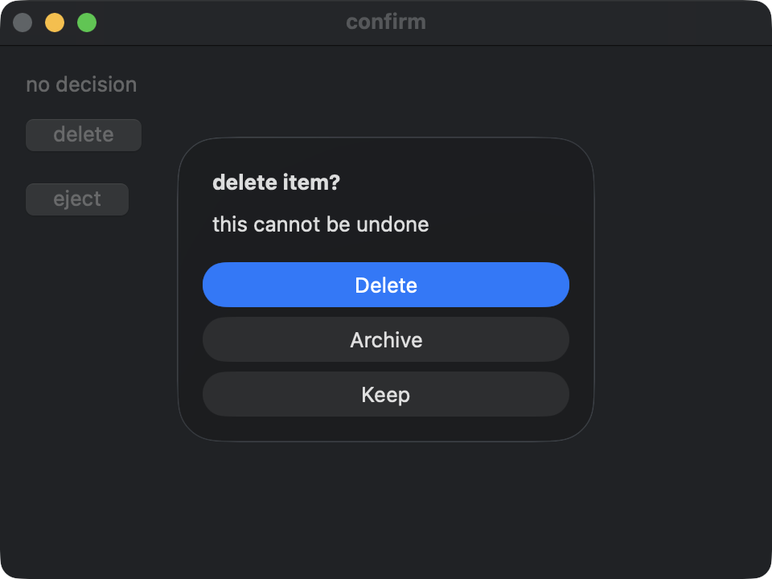
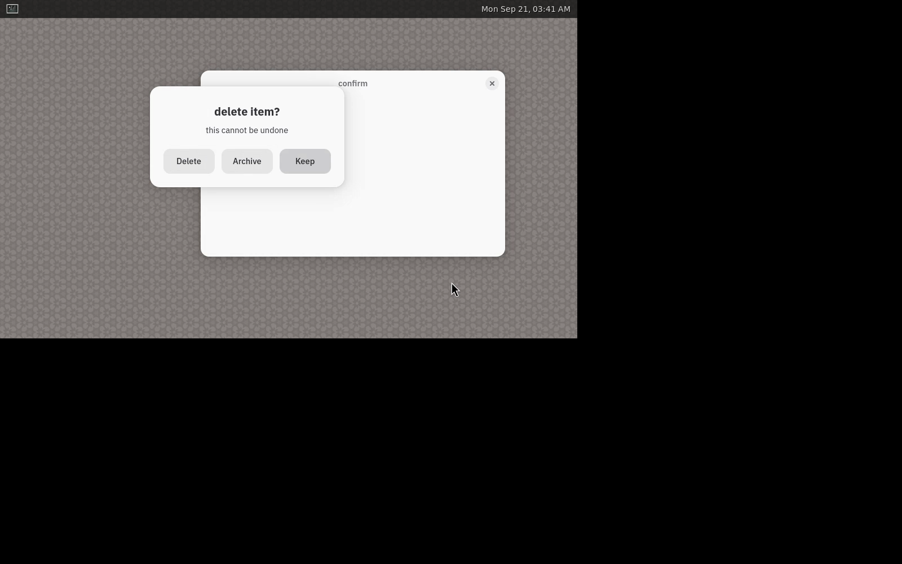
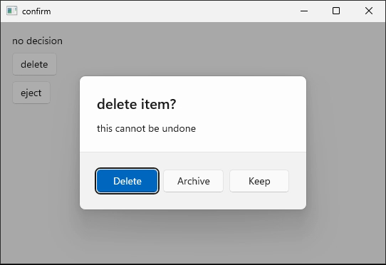
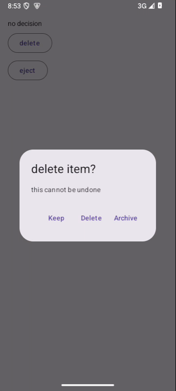

# Java async dialogs, 2026-09-20

Java now answers alerts, single and multiple file pickers, save panels and
clipboard reads with CompletableFuture. A continuation runs without an open
transaction; UI writes belong inside an explicit build.

```java
tx.button("delete", inner -> app.observe(
    inner.showAlert().title("delete item?").action("Delete").cancel("Keep")
        .showFuture().thenAccept(choice -> app.build(t -> {
            t.write(status, choice == KayaApp.AlertChoice.CANCEL ? "kept" : "deleted");
        }))));
```

app.observe reports a remaining failure in the final stage handed to it. It
does not schedule the chain or supply a transaction. Background workers still
use app.post to send a synchronous transaction to the app thread. Returned
builds remain committed; only a build whose body throws rolls itself back.
Callbacks remain available. Choosing onResult removes the future method from
the expression's type, and a retained alias is refused at runtime.

## Native captures

These are the actual Java guests on all four supported platforms. Each image
was viewed before inclusion. macOS, Windows and Android captures hold the first
alert with an extra settle; the original assertions then finish unchanged.
Linux uses its recorded Wayland run; its X11 run passed too. The visual dialog
and its choices are unchanged by the new future API. Java has no iOS lane.

### macOS



### Linux



### Windows



### Android



## Guards and validation

The real-binding headless checks cover five result forms and cancellations,
one-shot retirement, scope rollback, final-stage reporting, aborted requests,
callback compatibility and thread/template boundaries. A real parked occurrence
loop wakes to report a failure arriving from another thread. Fourteen runtime
mutations, four counted compiler negatives and fifteen surface cuts hold this
behavior, plus the surface census's empty-reader refusal.

628 core tests and 18 doctests passed (one ignored), as did the Java compile
checks and all 61 gates. Native dialog checks and reviewed captures
passed. Linux and Windows now include Java's existing save guest in their
regular rosters; sixteen counted roster cuts hold all four dialog scenes on
each Java lane. Full Mac passed 477 legs. The five-lane matrix passed in 18m25s:
Mac 477, Linux 777, Windows 283, iOS 139 and Android 148 legs, plus all 61 gates.
Every runtime ceiling held, with no failed leg in that matrix.

Review also found two recording defects. Android's duration probe still used
an invalid ffprobe log level and hid its error; a recording-only failure now
collects all seven recorder sections, verified by a forced red and readback.
Windows' pooled capture lost tile identities when guests changed their titles;
recording is now serial and retains its capturer transcript. Nine counted
negatives hold those corrections, bringing check-flightrec to 54.
