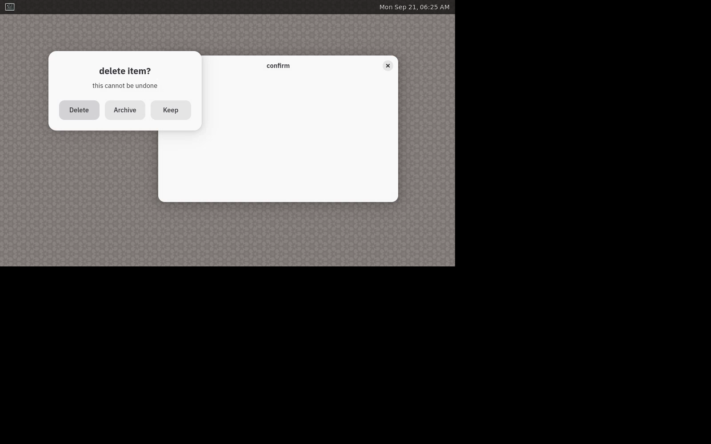
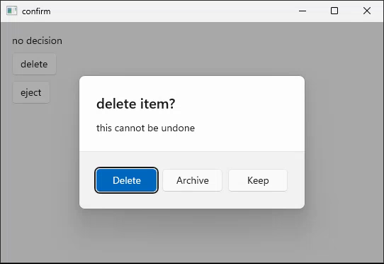
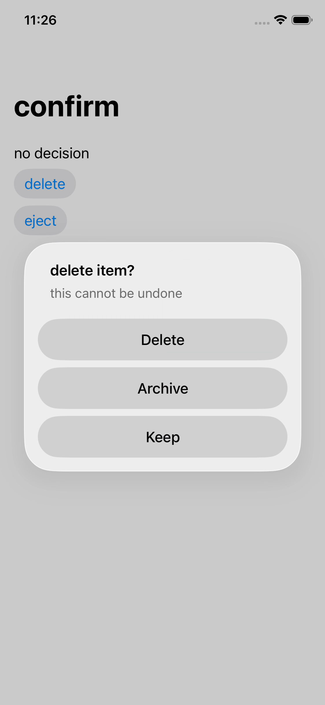
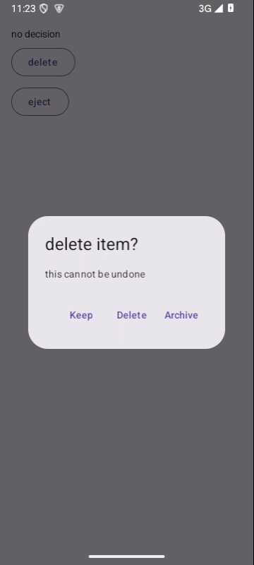

# Rust async dialogs, 2026-09-20

Rust now awaits alerts, single and multiple file pickers, save panels and
clipboard reads. An external TaskScope borrows AppCtx and owns local futures.
The guest enters the occurrence loop through tasks.next; continuations run on
that same app thread, without an open transaction.

```rust
let tasks = ctx.tasks();
while let Some(msg) = tasks.next(&msgs) {
    match msg {
        Msg::AskDelete => tasks.spawn(async move |app| {
            let choice = app.show_alert().title("delete item?")
                .action("Delete").cancel("Keep").await;
            app.apply(|tx| tx.write(status, match choice {
                AlertChoice::Cancel => "kept",
                _ => "deleted",
            }));
        }),
        _ => {}
    }
}
```

Each apply commits when its synchronous body returns, and rolls back if that
body panics. A later task failure does not undo completed scopes. The task
owner reports escaping panics and Result errors; it releases suspended tasks
at shutdown or scope drop. Background workers still use Poster to send a
synchronous scope to the app thread. The task launcher does not replace it.

Private begin and borrowed apply prevent retaining a transaction across an
outer await. Manually polling a nested future inside apply remains expressible
in Rust; runtime checks refuse occurrence-loop entry or dialog suspension with
an open transaction. No Send requirement excludes ordinary local Rc state.

## Native captures

These are the real Rust confirm guest on all five platforms, each viewed before
inclusion. The Mac, Windows, Android and iOS capture runs hold the first alert
for nine seconds, then finish the original assertions unchanged. Linux uses
the recorded Wayland run; X11 passed too. The Linux and Android images were
selected from their movies after early step-labelled stills showed startup.
The iOS image is the alert still before the first choice, after the hold.
The native dialog and its choices have not changed; its guest now awaits it.

### macOS


### Linux



### Windows



### iOS



### Android



## Guards and validation

The real-binding checks cover wakeups, local task ownership, five result forms,
cancellation, one-shot retirement, callback/future overlap, abort cleanup,
explicit-scope rollback, error reporting, reentry and shutdown. Fourteen Rust
production mutations were watched failing, each printing one substitution.
Twenty compiler cases pass: fourteen refusals and six accepted controls.

The same R1 checks found missing early overlap and abort-cleanup guards in JS.
Three production cuts were watched failing; malformed filters also reproduced
a registration leak before encoding was moved ahead of Promise construction.
The surface gate holds all five async tiers and the three callback-only tiers.
The nine-binding assessment is in the Rust measurement.

644 core tests and 25 doctests passed, with one existing ignored. All 61 gates
passed. Seven Mac hand legs passed: Rust confirm, filedialog, save and clipboard;
JS confirm, filedialog and save. The recorded Rust iOS suite passed all 49 legs,
and the standalone full Mac lane passed all 477. The final five-lane matrix
passed on 2026-09-21: Mac 477, Linux 777, Windows 283, iOS 139, Android 148 and
61 gates in 17m52s, every timing ceiling held. Its first attempt exposed an
Android drag-source lifetime bug; stable-root end ownership and expanded
recorder history were proved with a native red/green probe before this rerun.
