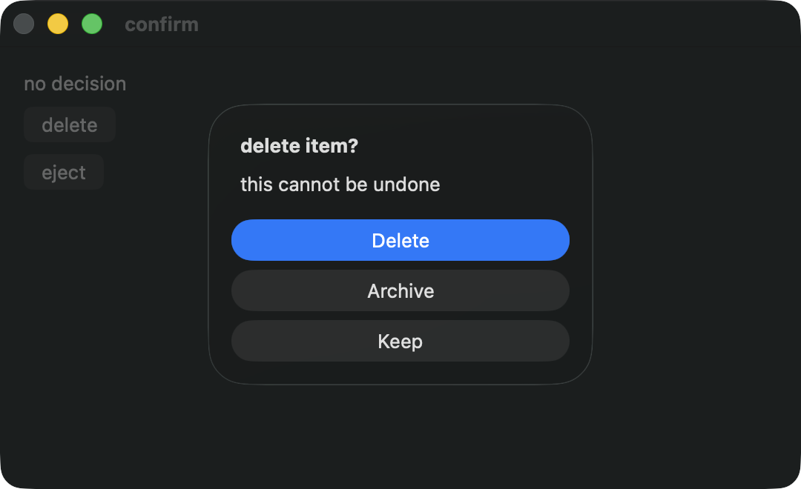
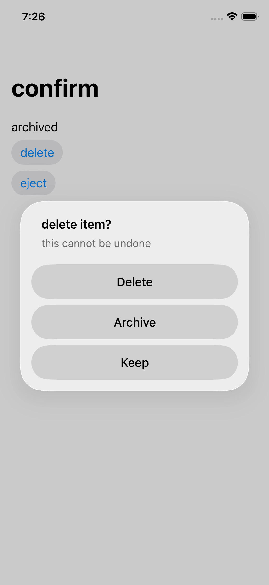

# Swift async dialogs, 2026-09-20

Swift can await alerts, single and multiple file pickers, save panels and
clipboard reads. Each continuation resumes on Kaya's app actor with no
transaction open. An explicit build is the unit of commit and rollback.

```swift
tx.button("delete") { _ in
    app.task {
        let choice = await app.showAlert(
            title: "delete item?", actions: ["Delete"], cancel: "Keep")
        app.build { tx in
            tx.write(status, choice == .cancel ? "kept" : "deleted")
        }
    }
}
```

app.task owns error reporting for the body handed to it. It does not store
errors or open a transaction. A later throw does not undo completed builds;
a build whose body throws rolls itself back. Raw Swift Tasks remain owned by
their caller, including raw tasks created inside this body.

## Native captures

Swift ships on macOS and iOS; the other three lanes do not package this binding.
The native dialogs and result values are unchanged.

### macOS



The image is an actual Swift confirm run, inspected before inclusion. The
unchanged script passed after the capture.

### iOS



The inspected video frame shows the third delete prompt, after the previous
answer set the label to archived. Its step-indexed filename is not a precise
timing claim: the capture calibration has an observed offset, so each frame
must be viewed before it is labeled. The confirm scene passed unchanged.

## Guards and validation

The compiler enforces actor entry and synchronous build bodies. Runtime checks
refuse retained transactions and overlapping dialogs. check-abort tests all five
results, cancellations, callback cleanup and scope atomicity, with ten watched
runtime mutations and three compile negatives. The surface gate holds twelve
API and occurrence-wiring clauses, each watched red after one substitution.

All eight Swift compile passes, 628 core tests, 18 doctests (one ignored), all
61 gates and the four native Mac dialog scenes passed. The full Mac lane passed
477 legs. All Swift scenes passed during iOS recording; its driver proof failed
after recording recovery reset the simulator service without restarting the
drivers. That lifecycle is corrected with three watched negatives. The recorded
suite retry passed 46 legs with all four drivers alive. The five-lane matrix
passed in 18m04s: Mac 477, Linux 775, Windows 282, iOS 139 and Android 148 legs,
plus all 61 gates, with every runtime ceiling held.

A sleeping-host failure exposed missing recorder
evidence; Mac failure bundles now include sleep/wake history, held by six
mutations and a forced-red bundle readback.
